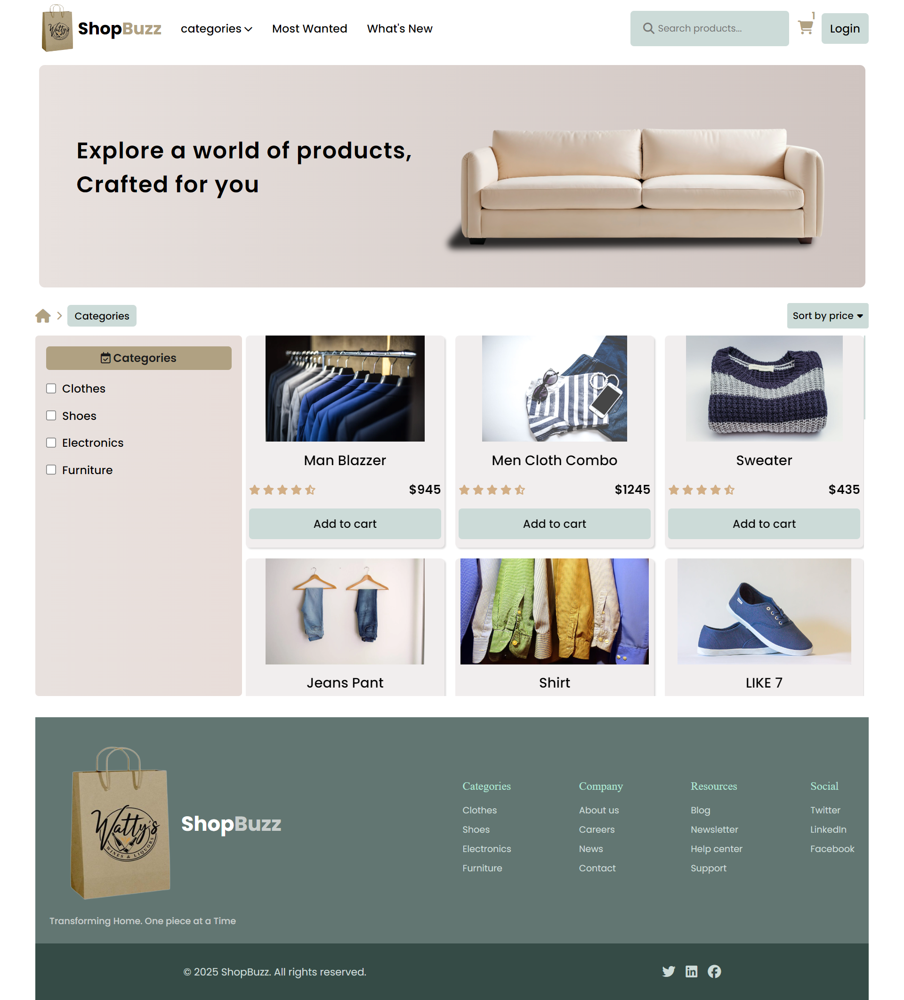
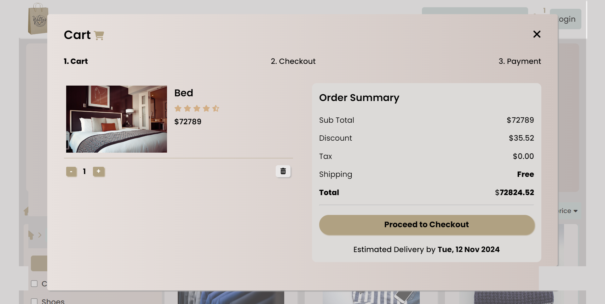
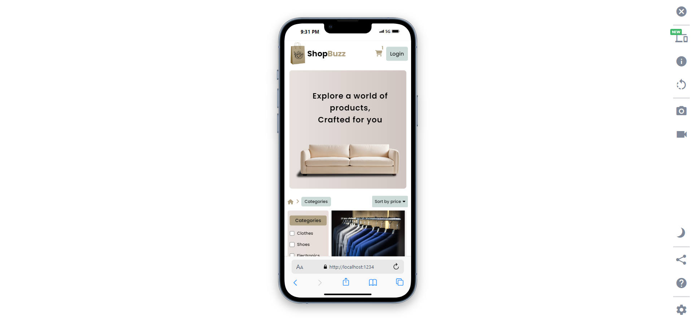
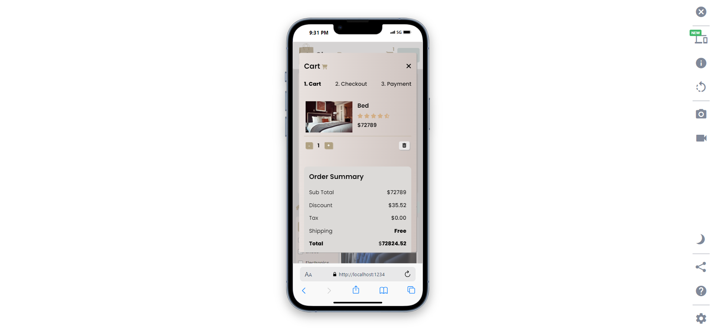

# 🛒 Full-Stack JavaScript Shopping Cart Application

[](https://developer.mozilla.org/en-US/docs/Web/JavaScript)
[](https://developer.mozilla.org/en-US/docs/Glossary/HTML5)
[](https://developer.mozilla.org/en-US/docs/Web/CSS)
[](https://github.com/typicode/json-server)
[](https://en.wikipedia.org/wiki/Object-oriented_programming)
[](https://parceljs.org/)

A full-stack JavaScript shopping cart application where users can browse products, add items to the cart, manage cart quantities, and more. Built with **HTML**, **CSS**, and **JavaScript** for the frontend, and **JSON Server** for backend data handling.

## 🖥️ **Demo**

🚀 **[Live Demo](https://shop-buzz.netlify.app/)**

---

## 📷 **Screenshots**

| Desktop View                                                                                                                                         | Mobile View                                                                                                                                                  |
| ---------------------------------------------------------------------------------------------------------------------------------------------------- | ------------------------------------------------------------------------------------------------------------------------------------------------------------ |
|  |  |

---

## ✨ Features

- 📂 **Category Selection**: Choose a category, and products within it will display.
- 🔍 **Product Search**: Find products quickly and easily.
- 🪄 **Price Sorting**: Sort products by price (low-to-high or high-to-low).
- 🛒 **Cart Management**:
  - Add products to the cart.
  - Increment/decrement product quantity.
  - Remove products from the cart.
- 📊 **Cart Overview**: View total cost and estimated delivery time in the cart.
- 🎉 **Toast Notifications**: Get alerts when adding/removing items.
- 💾 **Persistent State**: Uses Local Storage to save cart state.
- 📱 **Responsive Design**: Optimized for all devices.
- 🎥 **Vanilla CSS Animations**: Smooth transitions for a dynamic experience.
- 🔧 **Object-Oriented Design**: Structured with OOP principles for scalability.

## 🚀 Getting Started

### Installation

1. Clone the repository:

   ```bash
   git clone https://github.com/Abdur-Rahman-Apu/JS-cart-app-client.git
   ```

2. Run from the terminal.

   ```bash
   npm start
   ```

## 🛠️ Usage

- **Select Category**: Filter products by categories.
- **Search**: Use the search bar to locate specific products.
- **Sort**: Sort products by price.
- **Add to Cart**: Click on "Add to Cart" to add items.
- **Manage Cart**: In the cart, increase/decrease item quantities or remove items.
- **View Cost**: See the total cost and estimated delivery time in your cart.

## 🛠️ **Project Structure**

```bash
📦 JS-cart-app-client
├─ 📂 Src
   └─📂 Styles
     └─ style.css            # All CSS styles
   └─📂 assets              # All assets
   └─📂 JS
     └─ 📂cart              # cart related js files
     └─ 📂lib               # Repeated business logic
     └─ 📂productStore      # Data state
     └─ 📂storage           # Store data into the storage
     └─ 📂ui                # Update the DOM
     └─ 📂utils             # Utility functions
     └─ main.js             # Main js file
   └─ index.html            # HTML file
└─ README.md                # Project documentation
```

---

## 📊 Technologies Used

| Technology        | Description                      |
| ----------------- | -------------------------------- |
| HTML5             | Structure and layout             |
| CSS3              | Styling and animations           |
| JavaScript (ES6+) | Logic and dynamic features       |
| JSON Server       | Backend API for product data     |
| LocalStorage      | Data persistence across sessions |

## ✍️ Author

- **Abdur Rahman Apu** - [GitHub Profile](https://github.com/Abdur-Rahman-Apu) - [LinkedIn Profile](https://www.linkedin.com/in/abdur-rahman-apu/)

## ⭐ Support

If you like this project, give it a star! It helps me out a lot!

## 📄 License

This project is licensed under the MIT License - see the [LICENSE](LICENSE) file for details.
